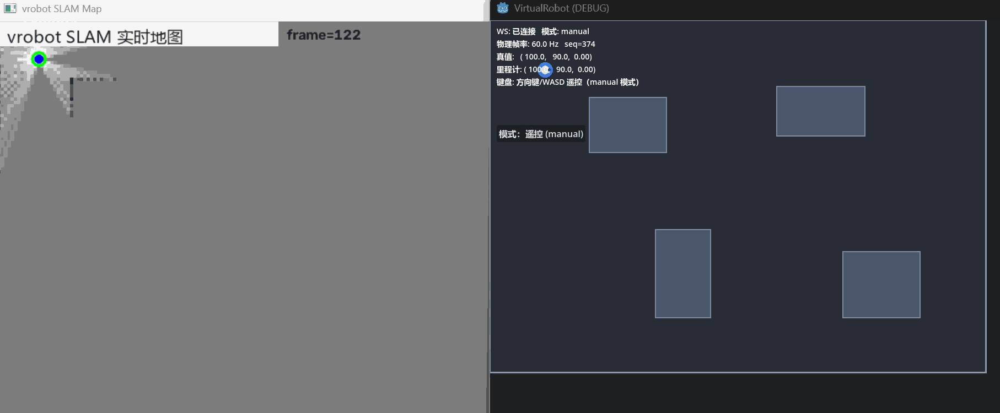

# VirtualRobot 🤖

**机器人仿真与定位算法验证平台** — Godot 4 无图传感器仿真 + Python 端 2D SLAM；一期覆盖清扫演示保留可运行。

[](https://godotengine.org)
[-blue)](docs/04-仿真器与算法端架构.md)
[](projects/brain)
[](LICENSE)

---

## 🗺️ 建图演示


*TourExplorer（FUEL-lite）自动探索建图实时画面 — 浅灰 = 已确认自由区，深色 = 墙体，红线 = 估计轨迹*

## ✨ 功能特性

**SLAM 验证模式（当前主模式）**
- **无图传感器仿真**：Godot 构建物理世界（墙体/家具/碰撞），输出带噪 2D 激光（144 线）与带噪里程计，不向算法端泄漏任何地图
- **2D SLAM 双引擎（Python 桥接）**：内置 TinySLAM 式实现（里程计预测 + 相关性扫描匹配 + 对数概率占据栅格 + 关键帧插入）与 **Google Cartographer**（pybind11 绑定 + 子图栅格桥接），配置一键切换
- **分层自主探索 FUEL-lite（`tour`，默认）**：frontier 聚类 → 观察点生成（射线投影信息增益）→ Dijkstra 距离场路径代价 → 增益/代价打分 → 最近邻 + 2-opt 环游逐腿执行 → 纯追踪跟随；重规划在后台线程（异步），20Hz 控制零阻塞；卡死逃逸 / 无进展看门狗 / 黑名单 TTL / 空图引导 / 动态障碍路径失效检测 / 位移门控收敛判据
- **三阶段混合探索（`hybrid`，可选）**：沿边探测（直行找边界 → 右手沿边 → 轨迹闭环）→ 弓形覆盖已知自由区 → Frontier 收尾，frontier 阶段后端可切 FUEL-lite / 经典贪心
- **经典 Frontier 探索（`frontier`，可选）**：A* 导航驶向"已知/未知边界"，目标承诺制 + 停滞保护
- **双驾驶模式**：算法端自动探索 / Godot 键盘遥控，cmd_vel 0.5s 超时安全停车
- **实时可视化 v2（OpenCV）**：占据概率地图 + 估计轨迹 + 真值对照，单帧合成 ~0.4ms（matplotlib 百倍提速），中文标注；自动回退 matplotlib
- **离线可验证**：合成理想世界端到端测试（自主建图：召回 99.4%、误报 1.5%、覆盖率 99.9%）

**一期覆盖清扫（保留演示）**
- 弓字形覆盖规划（CPP）+ A* 断点衔接、电量管理与回充、2D/3D 双版本可视化

## 🏗️ 架构

```
┌──────────────────────────┐  WebSocket(JSON) 20Hz ┌───────────────────────────┐
│ Godot 4 = 虚拟物理世界     │ ── sensor_frame ────▶ │ Python vrobot = 算法端      │
│ · 场景/物理碰撞            │  带噪里程计+2D激光      │ · 2D SLAM：建图 + 定位      │
│ · 传感器仿真（雷达/里程计） │ ◀── cmd_vel ─────────  │ · FUEL-lite 自动探索 / 遥控 │
│ · 键盘遥控 / 模式切换      │                       │ · OpenCV 实时地图可视化     │
│ · 轨迹渲染（操作员视角）    │ ── ground_truth ────▶ │ · 真值评估（不进算法）       │
└──────────────────────────┘   仅评估，可选           └───────────────────────────┘
```

- **无图铁律**：算法端永远不知道世界的真面目，只从带噪传感器流重建认知
- **契约先行**：消息格式唯一真相源在 `protocols/message-schema.md`，两端各自实现
- **一期一体式**（`core/` 内嵌算法 + 2D/3D 渲染）保留可运行，作"开天眼"对照基线

## 🚀 快速开始

### 环境要求

- [Godot 4.7+](https://godotengine.org/download)（标准版即可，无需 .NET）
- [uv](https://docs.astral.sh/uv/)（Python 包管理，Python ≥ 3.10 由 uv 自动准备；依赖：numpy / websockets / pyyaml / matplotlib / opencv-python）
- 可选：Blender（仅在需要编辑 `asserts/Robot.blend` 模型时安装）

### 运行（SLAM 验证模式，当前主模式）

```bash
# 1. 启动 Python 算法端（先启动，监听 ws://127.0.0.1:9094）
cd projects/brain
uv sync                                   # 首次：创建 .venv 并按 uv.lock 安装依赖
uv run python -m vrobot.apps.slam_node --config configs/slam2d.yaml

# 2. Godot 端：打开 projects/godot → F5（主场景 sim2d.tscn，无图传感器仿真）
#    HUD 显示"已连接"后：方向键/WASD 遥控采集数据，或点按钮切 Auto 让算法端驾驶
```

探索器通过 `configs/slam2d.yaml` 的 `explorer.mode` 切换：`tour`（FUEL-lite，默认）/ `hybrid` / `frontier` / `reactive` / `off`，各模式参数见配置内注释。

### 运行（一期一体式覆盖清扫演示，保留）

1. Godot 打开 `projects/godot`，运行 `scenes/main.tscn` 或 `main_3d.tscn`
2. 点击「开始」→ 弓字形清扫 + 回充全流程

### 测试

```bash
# Python 算法端（无需 Godot，合成世界端到端验证）
cd projects/brain && uv run pytest tests/ -v

# 分阶段隔离调试（引擎契约 / 探索闭环 / 全链路插桩，见 debug/README.md）
uv run python debug/stage2_carto.py       # cartographer 契约测试（离线）
uv run python debug/stage3_explorer.py    # 探索闭环对比：cartographer vs builtin（离线）

# Godot 一期无头单测
godot --headless --path projects/godot --script res://tests/run_tests.gd
```

## 🔧 Cartographer 引擎接入

SLAM 双引擎可配置切换（`configs/slam2d.yaml` → `slam.engine`）：`builtin`（TinySLAM 式内置实现）与 `cartographer`（**当前使用**）。

**引入方式**：

- **Python 桥接层** `src/vrobot/slam/cartographer_engine.py`：内嵌自动生成的 Lua 配置（量程/里程计/概率插入器参数），每帧喂入里程计 + 激光点云，取回位姿，并把 Cartographer 子图概率栅格桥接为占据栅格（供探索器与可视化消费）；`map_sync_interval` 控制同步频率
- **Native 绑定** `cpp/`（pybind11）：`mapper.cpp` 封装 MapBuilder 的轨迹生命周期（add_odometry / add_scan / 子图导出），编译产物 `vrobot_slam_native.pyd` 与全部依赖 DLL 预编译随仓分发于 `src/vrobot/slam/_bin/`，开箱即用
- **Cartographer 源码**：基于官方 2.0.0，使用 **VS2026** 编译，需要少量适配改动——修改内容已推送到 fork 仓库：**[BetterYan/cartographer](https://github.com/BetterYan/cartographer)**（从源码重建时请使用该 fork）

**已知限制**：纯旋转时角跟踪欠转 ~13%（随转角线性累积），可通过 `debug/stage2_carto.py`（T3 用例）复现；调优进展见路线图。

## 📁 项目结构

```
VirtualRobot/
├── asserts/
│   ├── Robot.blend            # 机器人模型源文件（Godot 4 可直接导入）
│   └── demo.gif               # 自主建图演示录屏
├── docs/                      # 设计与规划文档
│   ├── 00-项目总览.md          # 全局架构与演进路线
│   ├── 03-机器人定位算法调研.html # 定位算法技术调研（2026）
│   └── 04-仿真器与算法端架构.md # ★ 当前架构：无图仿真 + SLAM 验证
├── projects/
│   ├── godot/                 # Godot 4 虚拟世界（无图传感器仿真器）
│   │   ├── scenes/            # sim2d.tscn（主）+ main.tscn / main_3d.tscn（保留）
│   │   └── scripts/
│   │       ├── sim/           # ★ 传感器仿真：雷达/里程计/机器人/遥控/HUD
│   │       ├── transport/     # WebSocket 客户端 + 协议编解码
│   │       ├── core/          # 一期算法（保留作对照）
│   │       └── visualization*/ # 一期 2D/3D 渲染（保留）
│   └── brain/                 # Python 算法端（vrobot 包）
│       ├── src/vrobot/
│       │   ├── slam/          # ★ 2D SLAM：builtin + Cartographer 双引擎（_bin/ 预编译库）
│       │   ├── comm/          # WebSocket 服务端 + 消息编解码
│       │   ├── control/       # ★ 自动探索：FUEL-lite tour / hybrid / frontier
│       │   ├── planning/      # A* 路径规划
│       │   ├── viz/           # ★ 实时地图（OpenCV FastMapViewer / matplotlib 回退）
│       │   └── apps/          # 入口 slam_node.py
│       ├── configs/           # 算法参数（探索器模式/参数注释）
│       ├── debug/             # ★ 分阶段隔离调试套件（Stage 1-4 + 指南）
│       └── tests/             # 合成世界端到端测试
└── protocols/                 # 跨进程通信协议契约（语言无关）
    └── message-schema.md      # ★ v1.0 消息定义
```

## 🗺️ 路线图

- [x] 一期：Godot 一体式覆盖清扫（M1–M6，保留可运行）
- [x] 定位算法调研与选型（docs/03）
- [x] 无图仿真架构 + 通信协议 v1.0（docs/04 + protocols/）
- [x] Python 2D SLAM v1：扫描匹配 + 占据栅格（合成巡航：终点误差 2.4px，召回 100%）
- [x] Godot sim2d 传感器仿真场景 + Godot ↔ Python 实机联调
- [x] Frontier 自主探索建图：无人遥控自动获得完整地图（召回 99.4%，误报 1.5%）
- [x] **FUEL-lite 分层探索（tour）**：聚类 → 观察点信息增益 → TSP 环游 → 纯追踪，异步规划
- [x] **实时可视化 v2**：OpenCV 高性能地图窗口（~0.4ms/帧，中文标注），matplotlib 自动回退
- [x] **分阶段隔离调试套件**（debug/：引擎契约 / 探索闭环 / 全链路插桩）
- [x] Cartographer 引擎接入（VS2026 编译，fork：[BetterYan/cartographer](https://github.com/BetterYan/cartographer)）
- [ ] 覆盖规划移植回 Python 端（建图完成后自动切入弓形清扫，对应行业两阶段流程）
- [ ] Cartographer 纯旋转跟踪精度优化（角跟踪欠转 ~13%，`debug/stage2_carto.py` T3 可复现）
- [ ] v2：RBPF 粒子滤波 → v3：图优化回环
- [ ] 3D / VSLAM 扩展（sensors/slam3d）

## 📚 文档

| 文档 | 内容 |
|------|------|
| [docs/00-项目总览.md](docs/00-项目总览.md) | 架构、目录约定、演进路线 |
| [docs/03-机器人定位算法调研.html](docs/03-机器人定位算法调研.html) | 2026 定位算法全景调研与选型 |
| [docs/04-仿真器与算法端架构.md](docs/04-仿真器与算法端架构.md) | ★ 当前架构、算法管线、扩展规划 |
| [protocols/message-schema.md](protocols/message-schema.md) | WebSocket 消息 schema 契约 v1.0 |
| [projects/brain/debug/README.md](projects/brain/debug/README.md) | 分阶段隔离调试指南（Stage 1-4） |

## License

本项目基于 [MIT License](LICENSE) 开源。
